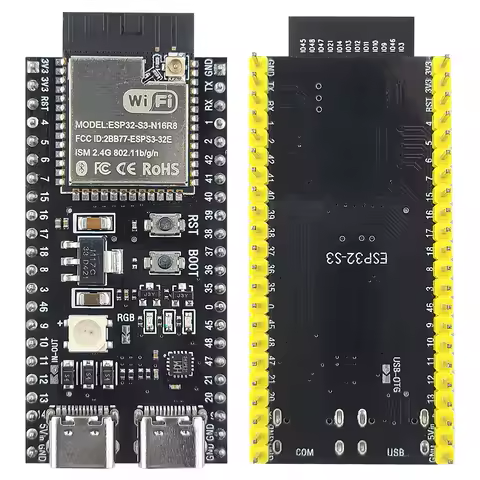
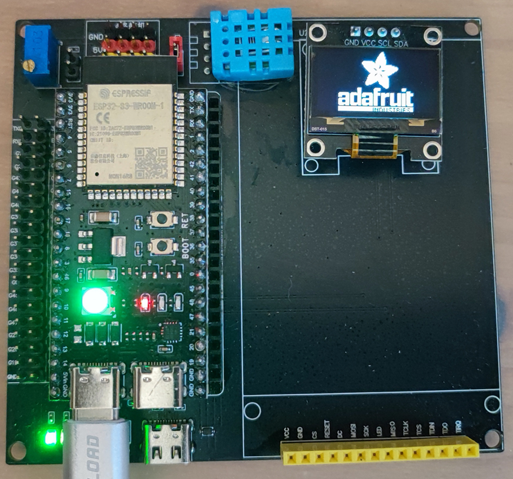
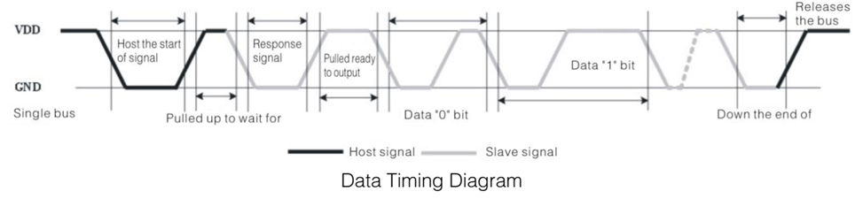
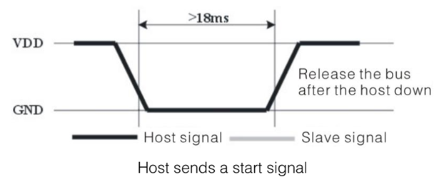
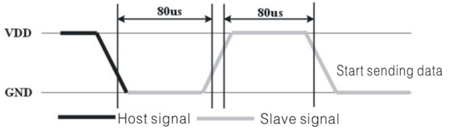
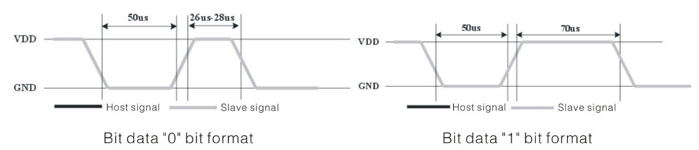

# Sujet de TP calculateur embarqué

L'objectif de ce TP est de réaliser un capteur de température et d'humidité capable d'envoyer ces mesures dans un **cloud**.

## Organisation des séances

L'objectif des séances est le suivant :
- Séance 1: Mesure de la température et de l'humidité et affichage de ces valeurs sur l'écran OLED.
- Séance 2: Création et décodage des données XML pour l'envoi et la réception des données.
- Séance 3: Connexion au réseau WIFI et envoi des données sur le service SOAP.

## Présentation du matériel

Le matériel est articulé autour d'un SOC ESP-S3-WROOM-1.



Cette carte comporte un SoC ESP32-S3-WROOM-1 N16R8. Les caractéristiques de ce SoC sont les suivantes:
- CPU double cœur à 240 MHz (1 cœur réservé au système, 1 cœur réservé à l'application)
- 384 Ko de ROM
- 512 Ko de RAM
- 16 Mo de flash
- 8 Mo de PSRAM
- WiFi 802.11b/g/n jusqu’à 150 Mbps
- Bluetooth 5 (LE)
- 36 GPIO

La liste complète des caractéristiques est disponible l'adresse suivante : [ESP32-S3-WROOM-1 Datasheet](https://documentation.espressif.com/esp32-s3-wroom-1_wroom-1u_datasheet_en.pdf)
Le manuel technique de référence est disponible à l'adresse suivante : [ESP32-S3 Technical Reference Manual](https://documentation.espressif.com/esp32-s3_technical_reference_manual_en.pd)

La carte possède également :
- une LED RGB de type [WS2812](https://cdn-shop.adafruit.com/datasheets/WS2812B.pdf) reliée au SoC par la broche 48
- un bouton RET ou RESET
- un bouton relié à la broche 0
- un connecteur USB-C (à gauche) relié à l'UART
- un connecteur USB-C (à droite) relié au port de débogage.

Cette carte fille est connectée à une carte mère possédant les composants suivants:
- un bouton RST ou RESET
- un bouton KEY relié à la broche 0
- un connecteur USB-C relié au port de débogage.
- un capteur de température et d'humidité relié à la broche 2
- un écran OLED 128x64 piloté par un contrôleur [SSD1306](https://cdn-shop.adafruit.com/datasheets/SSD1306.pdf) fonctionnant en I2C et relié aux broches SDA 42 et SCL 41.

## Environnement de développement

L'environnement de développement est articulé autour de Microsoft Visual Studio Code et de l'extension PlatformIO.
Les drivers pour le matériel sont les mêmes que ceux utilisés pour les TP de langage C.

Un projet déjà configuré est disponible à travers le dépôt Git suivant: [https://github.com/dibbaum/TP.Onboard.INSA.git](https://github.com/dibbaum/TP.Onboard.INSA.git).

1. Cloner le dépôt git
2. Relier la carte via le câble USB sur le port USB-C de **gauche
3. Compiler et transférer le programme
4. Vérifier son fonctionnement



## Première séance de TP

Durant cette séance, vous devrez mettre en œuvre le capteur de température et d'humidité.

Son fonctionnement est le suivant:



- Au repos, la broche 2 est configurée comme une sortie à l'état haut.
- Pour déclencher la transmission d'informations, la broche 2 doit être à l'état logique bas pendant au moins 18ms.
- La broche 2 est remise à l'état haut.




- Ensuite, la broche 2 est configurée en entrée avec une résistance de Pull up (INPUT_PULLUP).
- Le capteur commence à transmettre les informations.
- Le début de la transmission est indiqué par la mise à l'état bas pendant 80 us puis à l'état haut pendant 80 us.



- Un bit 0 est indiqué par la mise à l'état bas pendant 50 us puis l'état haut pendant 26 à 28 us.
- Un bit 1 est indiqué par la mise à l'état bas pendant 50 us puis l'état haut pendant 70 us.



- 40 bit sont transmis de la manière suivante:

Chaque octet est envoyé dans cet ordre : B7 B6 B5 B4 B3 B2 B1 B0.
Le premier octet (o1) est la partie entière de l'humidité.
Le deuxième octet (o2) est la partie décimale de l'humidité.
Le troisième octet (o3) est la partie entière de la température.
Le quatrième octet (o4) est la partie décimale de la température.
Le cinquième et dernier octet (o5) est la somme de contrôle, celle-ci est calculée de la manière suivante o5 = o1+o2+o3+o4. Si o5 est différent de o1+o2+o3+o4 les données doivent être rejetées.

- La fin de transmission est indiquée par la mise à l'état bas du signal pendant 50 us.
- La mesure peut être relancée en attendant un minimum de 2 secondes entre chaque mesure.


### Travail demandé

Écrire le programme permettant :
- De lire la température et l'humidité depuis le capteur. Pour cela, il sera possible de lire d'observer les données par scrutation en comptant le nombre de cycles pendant lequel le signal est à l'état haut et en déduire s’il s'agit d'un bit 0 ou 1.
- En utilisant l'API des [timers](https://docs.espressif.com/projects/arduino-esp32/en/latest/api/timer.html), utiliser un timer et une interruption pour lire le capteur toutes les 5 secondes.
- D'afficher les données sur l'écran OLED utilisant l'API [Adafruit GFX Library](https://cdn-learn.adafruit.com/downloads/pdf/adafruit-gfx-graphics-library.pdf)
- En utilisant l'API [Adafruit NeoPixel](https://github.com/adafruit/Adafruit_NeoPixel), allumer la LED en fonction de la température mesurée. La LED est bleue lorsque la température est inférieure ou égale à 18°C, rouge lorsque la température est supérieure ou égale à 25°C et verte dans les autres cas.

## Seconde séance de TP

En utilisant la librairie [TinyXML2](https://deepwiki.com/leethomason/tinyxml2#creating-an-xml-document), écrire le programme permettant de générer le contenu XML tel que décrit en cours.

```xml
<?xml version="1.0" encoding="UTF-8"?>
<Requete1 xmlns:xsi="http://www.w3.org/2001/XMLSchema-instance" id="1">
	<Donnees temperature="20.7" humidite="54.3"/>
</Requete1>
```

Afin de vérifier la validité du document, celui-ci pourra être transmis via la connexion série (Serial.Println).
